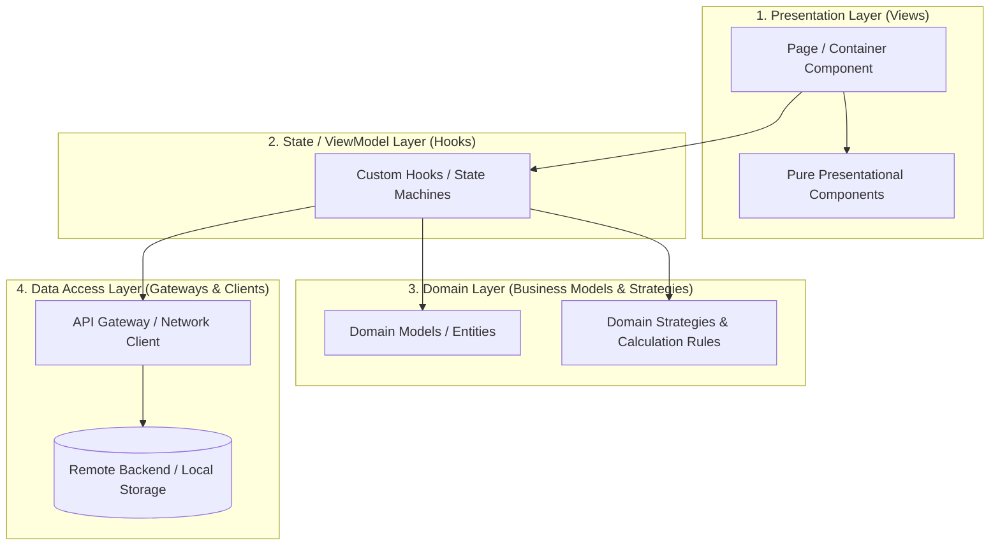

# Frontend Design Principles & Architecture Guide

> **Reference:** Distilled from Juntao Qiu & Martin Fowler's [*Modularizing React Applications with Established UI Patterns*](https://martinfowler.com/articles/modularizing-react-apps.html) (Thoughtworks / martinfowler.com).

---

## 1. Core Philosophy: React is a Humble View Library

A common pitfall in modern frontend engineering is treating React as an end-to-end application framework and cramming networking, caching, business rules, calculations, and layout into components and hooks.

### Core Tenet
> **"React is a humble library for building views, not the application itself."**

A frontend application is a full software system that happens to use React for rendering the DOM. The proven patterns of software design—**Separation of Concerns (SoC)**, **Presentation-Domain-Data Layering**, **Encapsulation**, and **Polymorphism**—apply directly to frontend codebases.

### Guiding Architectural Rules
1. **Thin Views:** Views should primarily map data structures to UI elements and forward user events.
2. **Decoupled Business Logic:** Domain rules, formatting, and calculations should exist as pure TypeScript/JavaScript entities, independent of React's render lifecycle.
3. **Targeted State Machines:** Hooks should act as orchestrators and state machines, not calculation dumps.
4. **Resilient Boundaries:** External API contracts must be insulated behind gateways / anti-corruption layers.

---

## 2. Layered Frontend Architecture

Organize frontend code into four distinct layers with a strict unidirectional dependency flow:



### Layer Responsibilities

| Layer | Primary Role | React-Aware? | Examples |
|---|---|:---:|---|
| **1. Presentation** | Renders DOM, handles user events, delegates actions | **Yes** | `Payment.tsx`, `PaymentMethods.tsx`, `DonationCheckbox.tsx` |
| **2. State / ViewModel** | Manages local UI state transitions, lifecycles, and side effects | **Yes** | `usePaymentMethods.ts`, `useRoundUp.ts` |
| **3. Domain** | Encapsulates business rules, calculations, formatting, validations | **No** | `PaymentMethod.ts`, `CountryPayment.ts`, `PaymentStrategy` |
| **4. Data Access** | Fetches remote data, handles network protocol, anti-corruption mapping | **No** | `fetchPaymentMethods()`, API clients, storage gateways |

---

## 3. The 5-Stage Evolution of Frontend Code

Frontend features naturally evolve through distinct phases. Recognizing these stages prevents unmaintainable tech debt:

```
[Stage 1: Monolithic Component]
       ↓ (Extract visual sub-trees)
[Stage 2: Multiple Presentational Components]
       ↓ (Extract lifecycle & state)
[Stage 3: State Management via Custom Hooks]
       ↓ (Extract data rules & calculations)
[Stage 4: Domain Models & Strategies]
       ↓ (Extract networking & anti-corruption adapters)
[Stage 5: Fully Modular Layered Architecture]
```

1. **Stage 1: Monolithic Component**
   - Everything (fetching, state, parsing, business calculations, JSX) lives inside a single component.
   - *Problem:* High cognitive load, fragile to change, impossible to unit test without heavy mocking.
2. **Stage 2: Multiple Presentational Components**
   - View is decomposed into smaller, single-purpose presentational components.
   - *Problem:* Component still mixes state management and business rules with UI orchestration.
3. **Stage 3: State Management via Custom Hooks**
   - Side effects (`useEffect`) and reactive states (`useState`) move into custom hooks.
   - *Problem:* Hooks often become bloated with business math, domain transformations, and networking logic.
4. **Stage 4: Domain Models Emerge**
   - Business calculations, defaults, and data transformations move into standalone domain classes/types.
   - *Benefit:* Pure business logic can be unit-tested without React testing utilities.
5. **Stage 5: Layered Architecture**
   - Networking is isolated behind API gateways; domain variations are modeled with polymorphism/strategies.
   - *Benefit:* Highly modular, readable, resilient to API and requirement changes.

---

## 4. Key Design Patterns & Implementation Guide

### 4.1. Humble View & Pure Presentational Components

Keep UI components as pure functions that map input props directly to JSX without internal state or side effects.

- **Characteristics:**
  - Stateless or purely transient visual state.
  - Predictable output given specific inputs (easy visual testing & Storybook integration).
  - No direct data fetching or complex business conditionals.

```typescript
// ✅ Pure presentational component: String/UI formatting only
interface PaymentMethodsProps {
  options: PaymentMethod[];
}

export const PaymentMethods = ({ options }: PaymentMethodsProps) => (
  <div className="payment-options">
    {options.map((method) => (
      <label key={method.provider}>
        <input
          type="radio"
          name="payment"
          value={method.provider}
          defaultChecked={method.isDefaultMethod}
        />
        <span>{method.label}</span>
      </label>
    ))}
  </div>
);
```

---

### 4.2. Custom Hooks as UI State Machines

Custom hooks should coordinate state transitions and view lifecycles. They act as the "controller" or "view model" between the view and domain layers.

- **Responsibilities:**
  - Coordinate domain models with React reactive state (`useState`, `useReducer`, `useMemo`).
  - Provide simple handlers (`updateAgreeToDonate`) rather than exposing raw setters (`setAgreeToDonate`).
  - Act as a finite state machine: incoming event → transition → new state output.

```typescript
// ✅ Hook manages state lifecycle and delegates calculations to the strategy
export const useRoundUp = (amount: number, strategy: PaymentStrategy) => {
  const [agreeToDonate, setAgreeToDonate] = useState<boolean>(false);

  const { total, tip } = useMemo(
    () => ({
      total: agreeToDonate ? strategy.getRoundUpAmount(amount) : amount,
      tip: strategy.getTip(amount),
    }),
    [agreeToDonate, amount, strategy]
  );

  const toggleAgreeToDonate = () => setAgreeToDonate((prev) => !prev);

  return { total, tip, agreeToDonate, toggleAgreeToDonate };
};
```

---

### 4.3. Domain Modeling to Prevent Logic Leaks

Never leak domain checks (e.g. `method.provider === 'cash'`) into presentational components or hooks. Encapsulate data and its associated behavior into domain models.

```typescript
// ✅ Domain entity encapsulating data contracts and business queries
export class PaymentMethod {
  private readonly remote: RemotePaymentMethod;

  constructor(remote: RemotePaymentMethod) {
    this.remote = remote;
  }

  get provider(): string {
    return this.remote.name;
  }

  get label(): string {
    return this.provider === "cash"
      ? `Pay in ${this.provider}`
      : `Pay with ${this.provider}`;
  }

  get isDefaultMethod(): boolean {
    return this.provider === "cash";
  }
}
```

**Why this matters:**
- If the default method condition changes (e.g., fallback provider configuration), only `PaymentMethod` changes.
- View components remain clean and declarative (`defaultChecked={method.isDefaultMethod}`).

---

### 4.4. Polymorphism / Strategy Pattern: Eliminating "Shotgun Surgery"

#### The Shotgun Surgery Smell
When expanding a feature (e.g., adding multi-country currency rules), branching logic (`if (country === 'JP') ... else if (country === 'DK') ...`) frequently spreads across:
1. Component templates (currency symbols)
2. Hook calculations (rounding increments)
3. Helper functions (label formatters)

Adding a single new country then requires modifying 4+ files simultaneously—a classic **Shotgun Surgery** code smell.

#### The Solution: Strategy Objects
Encapsulate algorithmic variations in a polymorphic strategy interface or composable strategy class:

```typescript
// 1. Define strategy interface
export interface PaymentStrategy {
  readonly currencySign: string;
  getRoundUpAmount(amount: number): number;
  getTip(amount: number): number;
}

export type RoundUpAlgorithm = (amount: number) => number;

// 2. Concrete strategy using composition
export class CountryPaymentStrategy implements PaymentStrategy {
  constructor(
    public readonly currencySign: string,
    private readonly algorithm: RoundUpAlgorithm
  ) {}

  getRoundUpAmount(amount: number): number {
    return this.algorithm(amount);
  }

  getTip(amount: number): number {
    const rounded = this.getRoundUpAmount(amount);
    return parseFloat((rounded - amount).toPrecision(10));
  }
}

// 3. Concrete algorithms (pure functions)
export const roundUpToNearestUnit: RoundUpAlgorithm = (amount) => Math.floor(amount + 1);
export const roundUpToNearestHundred: RoundUpAlgorithm = (amount) => Math.floor(amount / 100 + 1) * 100;

// 4. Concrete strategy factory / instances
export const paymentStrategies: Record<string, PaymentStrategy> = {
  AU: new CountryPaymentStrategy("$", roundUpToNearestUnit),
  JP: new CountryPaymentStrategy("¥", roundUpToNearestHundred),
};
```

**Benefits:**
- **Open/Closed Principle:** Adding a new region requires creating a new configuration, not modifying existing components.
- Zero conditional branches inside React render paths.

---

### 4.5. Gateways & Anti-Corruption Layer (ACL)

Do not let remote backend schema variations leak into component state. Isolate network transport and data mapping inside dedicated gateway functions or classes.

```typescript
// ✅ Gateway / Anti-Corruption Layer: Isolate remote schema
export const fetchPaymentMethods = async (): Promise<PaymentMethod[]> => {
  const response = await fetch("https://api.service.internal/payment-methods");
  if (!response.ok) {
    throw new Error(`Failed to load payment methods: ${response.statusText}`);
  }

  const remoteMethods: RemotePaymentMethod[] = await response.json();

  if (remoteMethods.length === 0) {
    return [];
  }

  const methods = remoteMethods.map((m) => new PaymentMethod(m));
  methods.push(new PaymentMethod({ name: "cash" })); // Business fallback
  return methods;
};
```

```typescript
// ✅ Hook remains completely agnostic of HTTP details or endpoint paths
export const usePaymentMethods = () => {
  const [paymentMethods, setPaymentMethods] = useState<PaymentMethod[]>([]);

  useEffect(() => {
    fetchPaymentMethods()
      .then(setPaymentMethods)
      .catch((err) => console.error(err));
  }, []);

  return { paymentMethods };
};
```

---

## 5. Architectural Anti-Patterns & Code Smells

| Anti-Pattern | Description | Recommended Refactoring |
|---|---|---|
| **Fat Component** | Components handling data fetching, formatting, calculations, and layout. | Split view into pure presentational components; extract state into hooks. |
| **Logic Leaks in JSX** | Inline business checks (e.g. `user.role === 'admin' && status === 2`). | Move checks into domain model getters (e.g. `user.canApproveOrder`). |
| **Fat Hook** | Custom hooks containing network serialization, data cleanup, and math. | Extract network to Gateways; extract math/formatting to Domain Models. |
| **Shotgun Surgery** | Adding one variation requires changes across components, hooks, and helpers. | Replace scattered conditionals with the **Strategy Pattern**. |
| **Leaky Data Contracts** | Passing raw backend DTOs directly down the component tree. | Use an **Anti-Corruption Layer (Gateway)** to map DTOs to Domain Entities. |

---

## 6. Testing Strategy by Layer

A major advantage of modular layered architecture is dramatically simplified testing:

```
+-----------------------------------------------------------------+
|  Presentation: Component Tests (React Testing Library / Visual) |
|  - Verifies DOM rendering and prop interactions                 |
+-----------------------------------------------------------------+
|  ViewModel: Hook Integration Tests (renderHook)                 |
|  - Verifies reactive transitions and event handler wiring       |
+-----------------------------------------------------------------+
|  Domain: Fast Unit Tests (Pure TypeScript / Jest / Vitest)      |
|  - Tests edge cases, calculations, currency rules, validations  |
+-----------------------------------------------------------------+
|  Data: Gateway Unit / Contract Tests (Mocked Fetch / MSW)       |
|  - Tests error handling, payload deserialization, mapping       |
+-----------------------------------------------------------------+
```

- **Domain Models & Strategies:** 100% pure TypeScript. Tests run in milliseconds with zero DOM setup or mocking.
- **Presentational Components:** Test solely that props render as expected and callbacks fire on click.
- **Hooks:** Test state machine transitions using `renderHook`.

---

## 7. Pragmatic Design: When to Extract vs. When to Keep Simple

Architecture should serve the problem, not add ceremonial overhead. Use this decision matrix:

| Scenario | Recommended Approach |
|---|---|
| **Simple Static UI / Single Form** | Keep together in a single cohesive component. Do not prematurely abstract into 5 files. |
| **Reusable UI Element** | Extract into a pure presentational component (`components/`). |
| **Component with non-trivial lifecycle or local state** | Extract into a custom hook (`hooks/`). |
| **Complex data transformations, validation rules, or calculations** | Extract into domain models/entities (`models/`). |
| **Variations across tenants, regions, or permission sets** | Extract into domain strategies (`strategies/` or `models/`). |
| **Network integration or local storage interaction** | Extract into an API client / gateway (`gateways/` or `api/`). |

---

## 8. Summary Checklist for Code Reviews

When authoring or reviewing frontend pull requests, verify:

- [ ] **Is the component humble?** Does it primarily handle rendering and event forwarding?
- [ ] **Are business calculations absent from JSX?** No arithmetic or business rules embedded in templates.
- [ ] **Are domain models free of React dependencies?** Domain classes/functions must not import `react` or use React hooks.
- [ ] **Is data transformation separated from data consumption?** Raw API data is shaped before reaching views.
- [ ] **Are conditionals open to extension?** Will adding a new option/market cause shotgun surgery? If yes, consider Strategy/Polymorphism.
- [ ] **Can the core business logic be tested in a headless environment?** If testing requires mounting a full React component tree just to verify a calculation, logic needs extraction.
